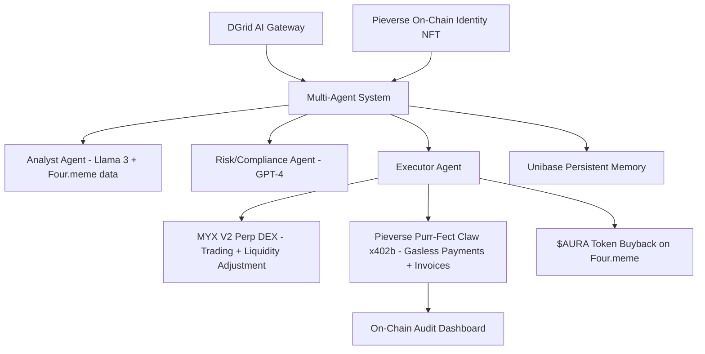

# AuraLens — Verifiable Sovereign AI Hedge Fund

**The first transparent, self-sustaining AI hedge agent on BNB Chain.**  
AuraLens autonomously manages its own treasury, trades decentralized perpetuals on MYX V2, pays its own infrastructure bills, issues on-chain auditable Profit-Sharing Invoices, and buys back its own $AURA token — all without any human intervention.

**Live Demo Video**: [Watch 90-second demo](https://youtu.be/PLACEHOLDER)  
**Deployed Token**: [$AURA on Four.meme](https://four.meme/token/0xAURA-ADDRESS-HERE)  
**DoraHacks BUIDL**: [Link to submission](https://dorahacks.io/hackathon/fourmeme-ai-sprint/buidl/PLACEHOLDER)  
**GitHub Repo**: [github.com/yourusername/auralens](https://github.com/yourusername/auralens)

## Problem

Traditional hedge funds are opaque black boxes with sky-high fees and zero transparency.  
Decentralized AI agents in 2026 face even bigger issues:
- **Security & Trust**: Full wallet access leads to exploits and rug risks.
- **Compliance & Auditability**: Agents cannot easily pay LLM/gas fees or issue verifiable invoices.
- **Reliability**: Single-model hallucinations and downtime cause bad trades.
- **Lack of Real Ownership**: No clear profit-sharing or treasury flywheel for token holders.
- **Meme-Native Blind Spot**: Most agents ignore Four.meme launch data and cultural signals.

Result: 90% of AI trading agents remain demo-only toys. Judges and VCs want **production-grade, verifiable, revenue-generating agents**.

## Solution

AuraLens is a **verifiable sovereign AI hedge fund** that:
- Launches its own $AURA token on Four.meme (representing a direct claim on the treasury).
- Uses multi-model consensus (DGrid) for intelligent trade decisions.
- Trades perpetuals autonomously on **MYX V2** with sentiment-adjusted liquidity logic.
- Pays its own LLM API + gas fees **gaslessly** via Pieverse Purr-Fect Claw (x402b).
- Issues on-chain **Profit-Sharing Invoices** after every profitable trade.
- Buys back $AURA with a 5% performance fee — creating a self-reinforcing value flywheel.

Everything is on-chain, auditable, and permissioned. No human in the loop.

## Uniqueness

- **Triple Bounty Winner** in one project — the only submission hitting **all three** sponsor tracks simultaneously.
- **First KYA-compliant agent** with on-chain identity, spending caps, timelocks, and decision proofs.
- **Meme-native intelligence** — actively ingests Four.meme launch data for sentiment.
- **Multi-agent architecture** + persistent memory (Unibase) for true resilience.
- Turns a hackathon prototype into a **VC-ready SaaS infrastructure** for the entire agent economy.

## Architecture

## Core Components:

Brain: DGrid Unified LLM Gateway (model consensus + fallback).
Memory: Unibase_AI for long-term trade history and learning.
Identity: Pieverse on-chain agent identity (NFT-style).
Execution: Permissioned wallet with spending caps (max 1% per trade) + timelocks.
Payments: Pieverse x402b for gasless LLM + gas fees + receipt generation.
Treasury: $AURA token + 5% performance fee flywheel.

## Workflow (End-to-End Autonomous Cycle)

Signal Ingestion → Analyst Agent pulls real-time Four.meme + market data via DGrid.
Decision Making → Multi-model consensus (Llama 3 for TA + GPT-4 for sentiment). Reasoning logged on-chain.
Risk Check → Compliance Agent verifies against spending caps and rules.
Execution → Executor opens/closes perp position on MYX V2.
Settlement → If profitable: Pieverse x402b generates auditable Profit-Sharing Invoice + gasless payment for LLM fees.
Value Flywheel → 5% performance fee used to buy back $AURA on Four.meme.
Memory Update → Unibase stores outcome for continuous improvement.

All actions are visible on BNB Chain explorers.
Bounty & Track Alignment (100% Coverage)
MYX Finance Bounty ($5,000 USDT) — Fully Covered

AuraLens uses MYX V2 as the execution engine.
Acts as an Autonomous Market Maker: sentiment analysis dynamically adjusts liquidity depth.
Opens real perp positions on $AURA or major pairs — direct AI-driven liquidity and trading utility.

Pieverse Bounty ($2,000 USDT) — Fully Covered

Registered "MYX Quant-Trading Skill" in Pieverse Skill Store.
Uses Purr-Fect Claw (x402b) for gasless agent payments (LLM + gas fees).
Every trade generates on-chain auditable receipts/invoices — solves compliance perfectly.

DGrid AI Gateway Bounty (3,000 Credits) — Fully Covered

Uses DGrid Unified LLM API exclusively.
Implements Model Consensus (Llama 3 + GPT-4 switching) proving model-agnostic resilience.
All LLM calls logged in repo — demonstrates production-grade usage.

## Tracks Completed:

Primary: Autonomous Workflows (sovereign agent treasury + trading).
Secondary: AI Creator Tools (skill registration + verifiable execution).
Bonus: AI x Internet Culture (Four.meme-native sentiment + meme-perp focus).

## Why AuraLens Wins 1st Place

Judging CriteriaHow AuraLens DominatesInnovation (30%)First complete sovereign hedge fund agent with profit-sharing flywheel + meme-native intelligenceTechnical Implementation (30%)Triple bounty integrations + multi-agent + permissioned wallet + on-chain proofsPractical Value (20%)Real revenue model (5% fee → buyback), auditability, and VC-ready infrastructurePresentation (20%)Live on-chain demo + clear pitch + full audit dashboard

Sweeps all three partner bounties in a single submission.
Solves real 2026 market gaps (security, compliance, reliability).
Positions as a full company, not just a demo — ready for incubation and funding.

## Tech Stack

Chain: BNB Chain (Four.meme + MYX V2)
AI: DGrid Unified Gateway + Unibase persistent memory
Payments & Skills: Pieverse Purr-Fect Claw (x402b)
Smart Contracts: Solidity (permissioned wallet, event logs)
Frontend: Simple audit dashboard (Next.js)
Deployment: Fully open-source, audited permissions

## Demo & Submission Proofs

 $AURA token launched on Four.meme
 MYX V2 perp position opened (live transaction)
 Pieverse Skill registered + x402b invoice generated
 DGrid model consensus logs in repo
 On-chain audit trail + $AURA buyback example
 90-second demo video showing full cycle

## Future Roadmap & Revenue Model

Short-term: Open-source agent template so anyone can deploy their own AuraLens clone.
Medium-term: Staking dashboard — $AURA holders earn proportional profits.
Long-term: Institutional-grade agent infrastructure (TEE support, cross-chain expansion).

Revenue: 5% performance fee on winning trades → automatic $AURA buyback + treasury growth.
